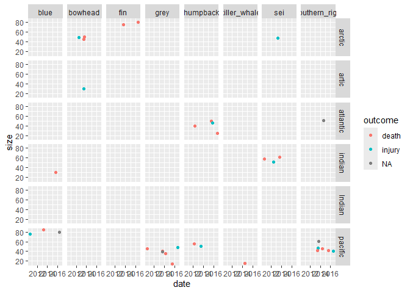

# lab06


# Load required packages

``` r
library(tidyverse)
```

    ── Attaching core tidyverse packages ──────────────────────── tidyverse 2.0.0 ──
    ✔ dplyr     1.1.4     ✔ readr     2.1.5
    ✔ forcats   1.0.0     ✔ stringr   1.5.1
    ✔ ggplot2   3.5.2     ✔ tibble    3.3.0
    ✔ lubridate 1.9.4     ✔ tidyr     1.3.1
    ✔ purrr     1.1.0     
    ── Conflicts ────────────────────────────────────────── tidyverse_conflicts() ──
    ✖ dplyr::filter() masks stats::filter()
    ✖ dplyr::lag()    masks stats::lag()
    ℹ Use the conflicted package (<http://conflicted.r-lib.org/>) to force all conflicts to become errors

``` r
library(knitr)
```

# Read in the data

``` r
whales <- read_csv("https://raw.githubusercontent.com/nt246/NTRES-6100-data-science/main/datasets/whales.csv")
```

    Rows: 31 Columns: 9
    ── Column specification ────────────────────────────────────────────────────────
    Delimiter: ","
    chr (8): blue, humpback, southern_right, sei, fin, killer_whale, bowhead, grey
    dbl (1): observer

    ℹ Use `spec()` to retrieve the full column specification for this data.
    ℹ Specify the column types or set `show_col_types = FALSE` to quiet this message.

``` r
whales |> 
  head() |> 
  kable()
```

| observer | blue | humpback | southern_right | sei | fin | killer_whale | bowhead | grey |
|---:|:---|:---|:---|:---|:---|:---|:---|:---|
| 1 | 1/20/15, death, , Indian | NA | NA | 8/9/11, injury, , indian | NA | NA | NA | NA |
| 2 | NA | 8/12/15, death, 50, atlantic | NA | NA | 8/2/13, death, 76, arctic | NA | 6/24/13, injury, 30, artic | NA |
| 3 | NA | NA | 7/14/13, injury, 47, pacific | NA | NA | NA | NA | NA |
| 4 | NA | 3/4/12, death, 56, pacific | NA | NA | NA | NA | NA | 5/24/16, death, , pacific |
| 5 | NA | NA | NA | 6/14/12, injury, 52, indian | NA | NA | NA | NA |
| 6 | 5/2/16, , 80, pacific | NA | NA | NA | NA | NA | NA | NA |

### Question 1. Create a new data frame that has one row per observer, per species and one single variable of all the information collected. Name this data frame whales_long.

``` r
whales_long <- whales |>
pivot_longer(-1, names_to = "species", values_to = "information")
whales_long |> 
  head() |> 
  kable()
```

| observer | species        | information              |
|---------:|:---------------|:-------------------------|
|        1 | blue           | 1/20/15, death, , Indian |
|        1 | humpback       | NA                       |
|        1 | southern_right | NA                       |
|        1 | sei            | 8/9/11, injury, , indian |
|        1 | fin            | NA                       |
|        1 | killer_whale   | NA                       |

### Question 2. Starting from whales_long, create another data frame that includes only events for which there is information. Name this data frame whales_clean.

``` r
#?is.na()
whales_clean <- whales_long |>
  filter(!is.na(information))
whales_clean |> 
  head() |> 
  kable()
```

| observer | species        | information                  |
|---------:|:---------------|:-----------------------------|
|        1 | blue           | 1/20/15, death, , Indian     |
|        1 | sei            | 8/9/11, injury, , indian     |
|        2 | humpback       | 8/12/15, death, 50, atlantic |
|        2 | fin            | 8/2/13, death, 76, arctic    |
|        2 | bowhead        | 6/24/13, injury, 30, artic   |
|        3 | southern_right | 7/14/13, injury, 47, pacific |

### Question 3. Starting from whales_clean, create another data frame with one variable per type of information, one piece of information per cell. Some cells might be empty. Name this data frame whales_split.

``` r
whales_split <- whales_clean |>
  separate(information, c("date", "outcome", "size", "ocean"), ",")
whales_split |> 
  head() |> 
  kable()
```

| observer | species        | date    | outcome | size | ocean    |
|---------:|:---------------|:--------|:--------|:-----|:---------|
|        1 | blue           | 1/20/15 | death   |      | Indian   |
|        1 | sei            | 8/9/11  | injury  |      | indian   |
|        2 | humpback       | 8/12/15 | death   | 50   | atlantic |
|        2 | fin            | 8/2/13  | death   | 76   | arctic   |
|        2 | bowhead        | 6/24/13 | injury  | 30   | artic    |
|        3 | southern_right | 7/14/13 | injury  | 47   | pacific  |

``` r
#must use "," in separate to specify where to cut the string
```

### Question 4. Starting from whales_split, create another data frame in which all columns are parsed as instructed below. Name this data frame whales_parsed.

``` r
whales_parsed <- whales_split |>
  type_convert(
    col_types = cols(
      date = col_date(format = "%m/%d/%y"),
      size = col_integer()
    )
  )
whales_parsed |> 
  head() |>
  kable()
```

| observer | species        | date       | outcome | size | ocean    |
|---------:|:---------------|:-----------|:--------|-----:|:---------|
|        1 | blue           | 2015-01-20 | death   |   NA | Indian   |
|        1 | sei            | 2011-08-09 | injury  |   NA | indian   |
|        2 | humpback       | 2015-08-12 | death   |   50 | atlantic |
|        2 | fin            | 2013-08-02 | death   |   76 | arctic   |
|        2 | bowhead        | 2013-06-24 | injury  |   30 | artic    |
|        3 | southern_right | 2013-07-14 | injury  |   47 | pacific  |

### Question 5. Using whales_parsed, print a summary table with: 1) number ship strikes by species, 2) average whale size by species, omitting NA values in the calculation

``` r
whales_parsed |> 
  group_by(species) |> 
  summarise(number_of_ship_strikes = n(), average_size = mean(size, na.rm = T))  |>
  kable()
```

| species        | number_of_ship_strikes | average_size |
|:---------------|-----------------------:|-------------:|
| blue           |                      5 |     67.50000 |
| bowhead        |                      5 |     43.75000 |
| fin            |                      4 |     78.50000 |
| grey           |                      7 |     36.83333 |
| humpback       |                      7 |     44.33333 |
| killer_whale   |                      2 |     15.00000 |
| sei            |                      5 |     54.75000 |
| southern_right |                      7 |     47.00000 |

### Question 6. Try to summarize as much information contained in whales_parsed as possible in one plot.

``` r
whales_parsed |>
  ggplot(aes(x=date, y = size, color=outcome)) +
  geom_point() +
  facet_grid(ocean~species)
```

    Warning: Removed 8 rows containing missing values or values outside the scale range
    (`geom_point()`).



``` r
# Load required packages
#install.packages("babynames")
library(babynames)


babynames |> 
  head() |> 
  kable()
```

| year | sex | name      |    n |      prop |
|-----:|:----|:----------|-----:|----------:|
| 1880 | F   | Mary      | 7065 | 0.0723836 |
| 1880 | F   | Anna      | 2604 | 0.0266790 |
| 1880 | F   | Emma      | 2003 | 0.0205215 |
| 1880 | F   | Elizabeth | 1939 | 0.0198658 |
| 1880 | F   | Minnie    | 1746 | 0.0178884 |
| 1880 | F   | Margaret  | 1578 | 0.0161672 |

``` r
#View(babynames)
```

### Question 1: What are the 6 most popular boy names and girl names of all time? How has the popularity of each of these names changed over time?

``` r
top_6_boy_names <- babynames |>
  filter(sex == "M") |>
  group_by(name) |>
  summarise(total_count=sum(n)) |>
  slice_max(order_by = total_count, n = 6)

top_6_girl_names <- babynames |>
  filter(sex == "F") |>
  group_by(name) |>
  summarise(total_count=sum(n)) |>
  slice_max(order_by = total_count, n = 6) 

#slice_max(order_by = total_count, n = 6) select 6 rows with the highest values in total_count; in this instance, using arrange() and head() is equivalent

babynames |>
  filter(
    (name %in% top_6_boy_names$name & sex == "M") | (name %in% top_6_girl_names$name & sex == "F")
    ) |>
  ggplot(aes(x=year, y=prop, group=name, color=sex)) +
  geom_line() +
  facet_wrap(~name)
```


### Question 2. What are the most popular boy names and girl names in each decade?

``` r
babynames |>
  mutate(decade = floor(year / 10) * 10) |>
  group_by(decade, sex, name) |>
  summarise(total = sum(n), .groups = "drop") |>
  group_by(decade, sex) |>
  slice_max(order_by = total, n = 1, with_ties = FALSE) |>
  arrange(decade, sex) |>
  kable()
```

| decade | sex | name     |  total |
|-------:|:----|:---------|-------:|
|   1880 | F   | Mary     |  91668 |
|   1880 | M   | John     |  89950 |
|   1890 | F   | Mary     | 131136 |
|   1890 | M   | John     |  80665 |
|   1900 | F   | Mary     | 161505 |
|   1900 | M   | John     |  84593 |
|   1910 | F   | Mary     | 478642 |
|   1910 | M   | John     | 376323 |
|   1920 | F   | Mary     | 701746 |
|   1920 | M   | Robert   | 576362 |
|   1930 | F   | Mary     | 572942 |
|   1930 | M   | Robert   | 590716 |
|   1940 | F   | Mary     | 640023 |
|   1940 | M   | James    | 795660 |
|   1950 | F   | Mary     | 625558 |
|   1950 | M   | James    | 843489 |
|   1960 | F   | Lisa     | 496972 |
|   1960 | M   | Michael  | 833254 |
|   1970 | F   | Jennifer | 581772 |
|   1970 | M   | Michael  | 707647 |
|   1980 | F   | Jessica  | 469472 |
|   1980 | M   | Michael  | 663690 |
|   1990 | F   | Jessica  | 303086 |
|   1990 | M   | Michael  | 462314 |
|   2000 | F   | Emily    | 223658 |
|   2000 | M   | Jacob    | 273793 |
|   2010 | F   | Emma     | 158573 |
|   2010 | M   | Noah     | 145195 |
