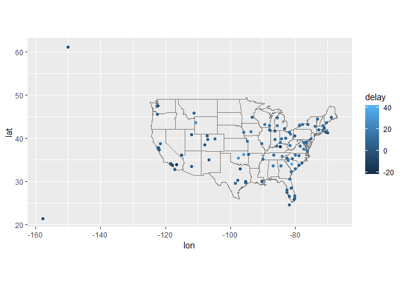

# lab7


``` r
library(tidyverse)
```

    ── Attaching core tidyverse packages ──────────────────────── tidyverse 2.0.0 ──
    ✔ dplyr     1.1.4     ✔ readr     2.1.5
    ✔ forcats   1.0.0     ✔ stringr   1.5.1
    ✔ ggplot2   3.5.2     ✔ tibble    3.3.0
    ✔ lubridate 1.9.4     ✔ tidyr     1.3.1
    ✔ purrr     1.1.0     
    ── Conflicts ────────────────────────────────────────── tidyverse_conflicts() ──
    ✖ dplyr::filter() masks stats::filter()
    ✖ dplyr::lag()    masks stats::lag()
    ℹ Use the conflicted package (<http://conflicted.r-lib.org/>) to force all conflicts to become errors

``` r
library(knitr)
library(nycflights13)  #install.packages("nycflights13")

flights |> head() |> kable()
```

| year | month | day | dep_time | sched_dep_time | dep_delay | arr_time | sched_arr_time | arr_delay | carrier | flight | tailnum | origin | dest | air_time | distance | hour | minute | time_hour |
|---:|---:|---:|---:|---:|---:|---:|---:|---:|:---|---:|:---|:---|:---|---:|---:|---:|---:|:---|
| 2013 | 1 | 1 | 517 | 515 | 2 | 830 | 819 | 11 | UA | 1545 | N14228 | EWR | IAH | 227 | 1400 | 5 | 15 | 2013-01-01 05:00:00 |
| 2013 | 1 | 1 | 533 | 529 | 4 | 850 | 830 | 20 | UA | 1714 | N24211 | LGA | IAH | 227 | 1416 | 5 | 29 | 2013-01-01 05:00:00 |
| 2013 | 1 | 1 | 542 | 540 | 2 | 923 | 850 | 33 | AA | 1141 | N619AA | JFK | MIA | 160 | 1089 | 5 | 40 | 2013-01-01 05:00:00 |
| 2013 | 1 | 1 | 544 | 545 | -1 | 1004 | 1022 | -18 | B6 | 725 | N804JB | JFK | BQN | 183 | 1576 | 5 | 45 | 2013-01-01 05:00:00 |
| 2013 | 1 | 1 | 554 | 600 | -6 | 812 | 837 | -25 | DL | 461 | N668DN | LGA | ATL | 116 | 762 | 6 | 0 | 2013-01-01 06:00:00 |
| 2013 | 1 | 1 | 554 | 558 | -4 | 740 | 728 | 12 | UA | 1696 | N39463 | EWR | ORD | 150 | 719 | 5 | 58 | 2013-01-01 05:00:00 |

``` r
avg_dest_delays <-
  flights |>
  group_by(dest) |>
  # arrival delay NA's are cancelled flights
  summarise(delay = mean(arr_delay, na.rm = TRUE)) |>
  inner_join(airports, by = c(dest = "faa"))

avg_dest_delays |>
  ggplot(aes(lon, lat, colour = delay)) +
  borders("state") +
  geom_point() +
  coord_quickmap()
```


